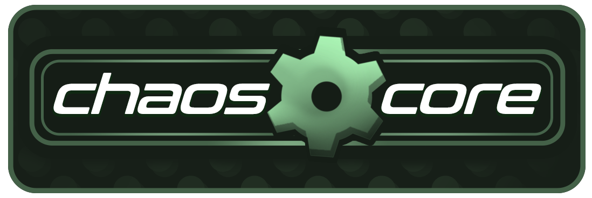

### ChaosCore is a codebase written in C# for use within S&Box engine. 

It functions as a starting point for all kinds of games that needs some basis to work off. Distributed under MIT license it will allow developers to develop their games faster and have better grounds for shared contribution.

## Main Goals

- Structure of the code is built with the entity system being the main inspiration (Source 1 or 2 alike). Functions and logic are deriving from BaseEntity component with custom, more dev friendly serialization method.
- Improved UX for scene workflow, mimicking the Source approach to interaction with entities which includes better scaleable gizmo solution, that can be overriden per entity.
- Wide and straightforward support for FPS/TPS games out of the box, quick and easy setup process with wide range of feature sets out of the box.
- Project agnostic codebase, that can be easily extended without much hassle to make anything you want with.
- Heavy reliance on data/resource approach to storing extendables for weapons, items, player setup and npc actions.
- Functional for both Single-Player or MultiPlayer projects.

## Features

- GOAP based NPC system, with scripted sequences (includes animgraph playback)
- Flexible BasePlayer codebase.
- Includes XGUI: VGUI inspired ui creation platform, includes WYSIWYG designer tool for faster production. Scales from being able to create entire user interface creation to simple debug panels, of IMGUI equivalence.
- Includes XMovemevent: Extendable and robust Player Controller, aimed to create all kinds of movement.
- Source IO equivalent logic setup for ActionGraph (S&box visual scripter), helps meld the best of two worlds and make it easier, more structured to add actions for various logic entities.
- Scaleable interaction system with world objects, from simpler interactions to player derived one's.

## Coming in the future
- Full FMOD support and implementation.
- User friendly ai relationship setup tool, to be made while inspired by collission matrix rule sets.
- Faceposer equivalence for choreography creation processes in spirit. Will include various improvements on the idea with better, more stable UX.
- Extendable object(or entity) placer that can be adjusted per project. Similar to entity placement in Source 1/2, but highly moddable without messing with FGD's.
- Data driven vehicle system.
- Proper networking support.
- FPS games: First person body support.